## Beyond the classroom: Opportunites are vast

* **Research opportunities exist year round**
    + Shepherd - Independent research (fall/spring)
    + Shepherd - Summer programs
    + Regionally - Partnerships for West Virginia Students
    + Nationally (and beyond) - Semester and summer programs
    
 

* **Internships (paid or unpaid)**
    + Industry
    + Healthcare
    + Animal Care
    + Data Science
    
 

* **Study Abroad programs**
    + summer, semester and year long

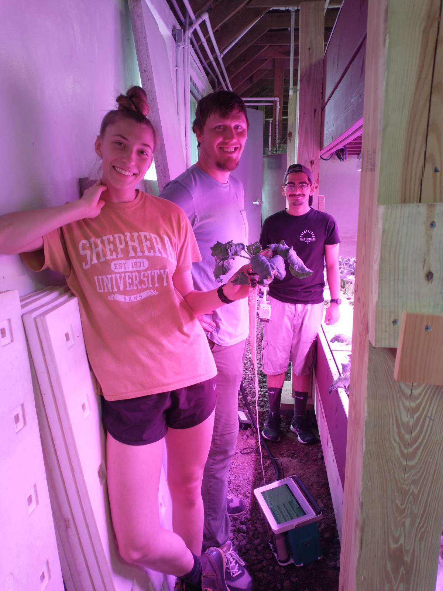

## Why should you pursue research opporunities?

 

* **Test the waters...**
    + Is this something I could see myself doing?
    + Helen (Dr. C's fern nerd friend) wanted to be a vet so bad....
    
 

* **Set your resume apart...**
    + STEM job market is competitive
    + Graduating undergraduate resumes are 'light on content'
    + output from research = currency for future opportunities
    
 

* **Gain experience in chosen field...**
    + embrace your natural science curiosity

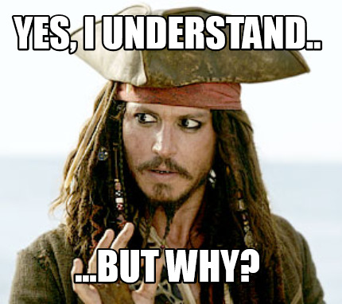

## Why should you pursue research opporunities?

 
 
 

* **Create a network...**
    + Many future opportunities are created by YOU
    + collborations can last your whole career

 

* **Broaden your horizons...**
    + work with people from all background due to the global nature of science

## Dr. C's undergraduate experiences...

 

* **Study Abroad Costa Rica: Medicinal Plants**
    + paid for by summerwork at golf course
    + 5 week coarse in July
    
 

* **Study Abroad Costa Rica: Primate Behavior**
    + paid for by summerwork at golf course
    + 5 week coarse in December

 

* **Greenhouse internship at BASF (chemical corporation)**
    + $7/hr - I was rich!!!
 

 
**Although I was too immature to know it at the time, these experiences defined by future path**

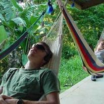

## Do I have your attention?!? - When should you start???

 

* **Power through your first year and focus on grades**
    + Set a standard for yourself
    + Don't be afraid to be excellent
    + Dr. C gives a pass for f-ing off your first summer

 

* **Sophomore and Junior Years are ideal**
    + You should be in a 'college groove'
    + Many external programs target these years
    + Enough time to complete meaningful independent research
    + Build your resume in a sustainable way that also balances school

 

* **These are just suggestions!!!**
    + Reflect on every semester and decide what you can, should and want to do

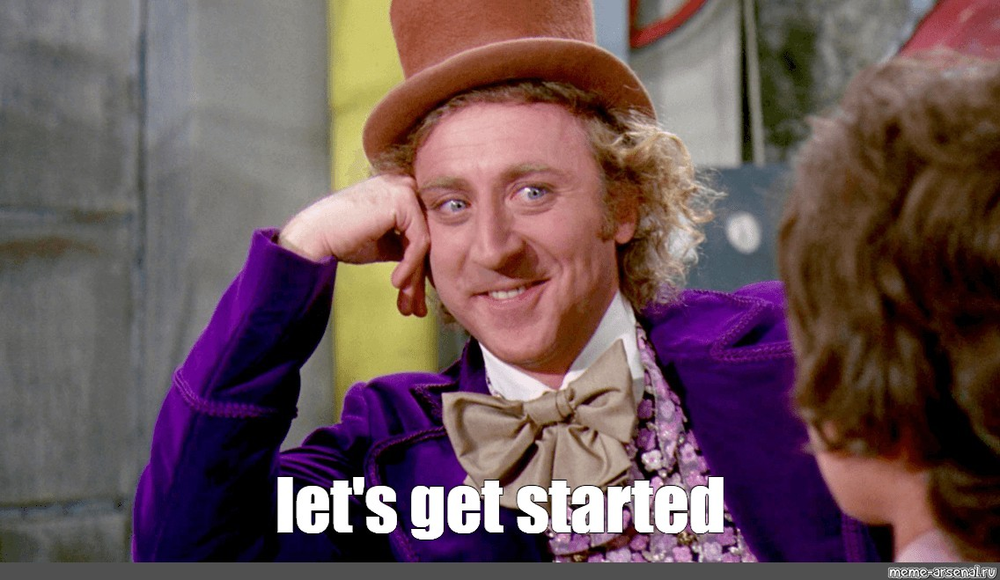

## How do you even know where to start....

 
**Don't worry...the different science departments at Shepherd have your back!!**

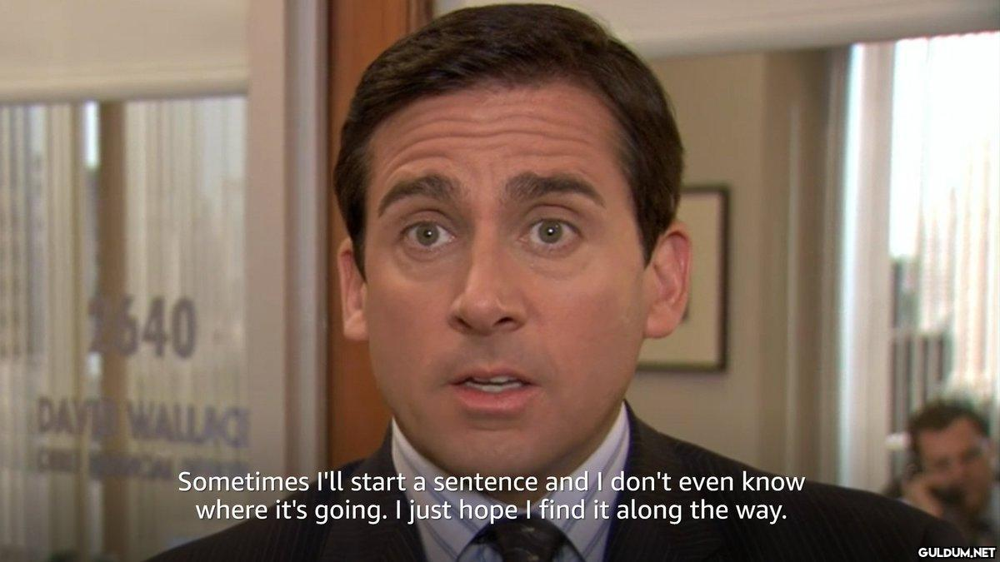

## Shepherd: Many faculty run small research programs

* **Do some background work:**
    + Look at faculty profiles on department webpages
    + Build relationships with professors during courses
    + Search their research history online (Google Scholar)
    
 

* **Express an interest in related research to a faculty that resonates with you**
    + have some common interests to discuss
    + DO NOT: Hey Dr. C, I want research experience for med school, can I work in your lab?
    + You do not have to have a solid project in mind
  
 

* **The realities of undergraduate research at Shepherd...**
    + faculty teach a lot! (this differs from other places)
    + faculty have limited time for research (Dr. C = Tuesday morning)
    + Don't take it personally if we have to say 'no'
    
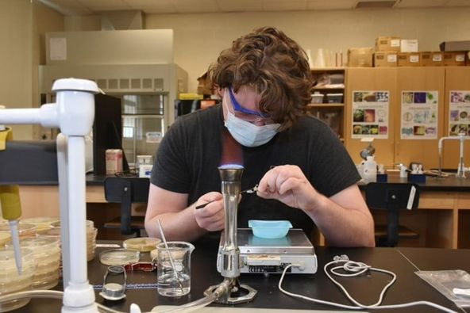

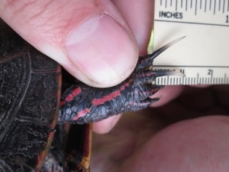

## Shepherd University: Internal research programs

* **Shepherd Opportunities to Attract Research Students (SOARS) program**
    + 10 week summer research program
    + students receive a stipend (~$4,000)
    + individual faculty mentors across STEM departments
    + research presented at WVAS conference
    + applications and mentor list posted in January
    + applications due in February

 

* **NASA West Virginia Space Grant Consortium fellowship program**
    + students apply in September (all STEM fields)
    + receive stipends for Fall and Spring research
    + present a poster at WVAS

 

* **KEY ADVICE: Talk to potential mentors before applying**
    

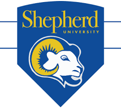

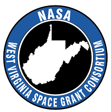

## Beyond Shepherd: Regional opportunties are vast

* **West Virginia INBRE - Biomedical Summer Research (http://www.wv-inbre.net/)**
    + competitive federal research program of the National Institutes of Health
    + open to the network of WV undergraduate institutions
    + mentored research at WVU or Marshall University

 

* **Program specifics**
    + students receive a stipend (~$4,500)
    + 9-week summer program
    + work with faculty and graduate students
    + present at research symposium

 

* **Lots of research topics: genetics and health, cancer biology, neurobiology, etc.**
    + covers many science disciplines

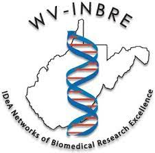

## Beyond Shepherd: Regional opportunties are vast

* **American Heart Association - Summer Research Program at Marshall University**
    + https://jcesom.marshall.edu/research/office-of-research-and-graduate-education/research-clusters/cardiovascular-disease-research-cluster-cdrc/
    + 9-week summer research experience 
    + students receive a stipend (~$6,000)
    + research related to heart disease and stroke
    + present research at a conference
    
 

* **Smithsonian Environmental Research Center (SERC) internships**
    + https://serc.si.edu/internships
    + research experiences cover environmental chemistry, marine and estuarine ecology, molecular ecology, and terrestrial ecology
    
  

* **Smithsonian Institution internships**
    + https://www.si.edu/ofi   
    + musuem - zoo - research
    

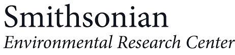

## Beyond Shepherd: Pathway Programs are close (and far)

 
    
* **Pathways Programs at National Parks (Shenandoah NP)**
    + https://www.nps.gov/aboutus/pathways.htm
    + paid internships to explore park service careers
    
 

* **Pathways Programs at USGS (e.g., Reston, VA)**
    + https://www.usgs.gov/human-capital/pathways-internship-program  

  

* **Pathways Programs at the USDA**
    + https://www.usda.gov/youth/career
    + Fruit research center near Kearneysville, WV
    
 

**Get to know https://www.usajobs.gov/ for all federal gov't opportunities**

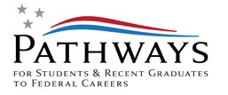
    
## Beyond Shepherd: Industry internships are vast

* **Available for many disciplines (chemistry, biology, engineering, etc.)**

 

* **Merck Pharmaceutical internships:**
    + https://jobs.merck.com/us/en/student-opportunities
    + https://jobs.merck.com/us/en/interns

 

* **Proctor & Gample Internships:**
    + https://www.pgcareers.com/internships

 

* **Eli Lilly Internships:**
    + https://careers.lilly.com/us/en/

 

* **BASF Internships:**
    + https://www.basf.com/us/en/careers/students/internship.html
    

## DC and Frederick, MD are hotbeds for biotechnology

**https://www.biospace.com/biocapital/** - Therapeutics and Vaccines development are thriving

## Find and use the listservs - job sites for your field of interest

* **A few large science job boards exists**
    + https://jobs.sciencecareers.org/
    + not always great for internships

 

* **Ecology and Environmental biology**
    + ECOLOG-L (hosted by Ecological Society of America)
    
 

* **Many national societies have opportunity boards by career stage:**
    + Cell Biology: https://jobs.ascb.org/
    + Biochemistry and Molecular Biology:  https://careers.asbmb.org/
    + Ecology: https://www.esa.org/career-development/
    + Chemistry: https://getexperience.acs.org/
    + Chemistry: http://global.acs.org/
    + Engineering: https://www.asee.org/education-jobs/FELLOWSHIPS/EcoCAR
    

    
## Gold Standard Opportunites: NSF-REU

* **National Science Foundation - Research Experience for Undergraduates**
    + https://www.nsf.gov/crssprgm/reu/reu_search.jsp
    + students receive a stipend (~$6,000)
    + assitance with travel and housing provided
    + provides additional career training
    + groups of ~10 undergraduates at a host institution

 

* **NSF REU programs cover most STEM disciplines**
    + many REU sites across the USA
    + target sophomore and junior (not a hard rule)

 

* **NSF REU's are extremely competitive**
    + application window: November - February (you must actively search)
    + likely need to apply for many in one cycle
    + Shepherd students are absolutely competitive!

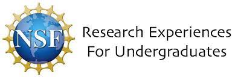  

## Gold Standard Opportunites: NIH-SIP

 

* **National Institute of Health - Summer Internship program**
    + https://www.training.nih.gov/programs/sip
    + spend summer working with leading biomedical researchers
    + 8-week program with a stipend (changes yearly)
    + provides additional career training
    + present at symposium 
    + Main campuses are near Baltimore & DC (others exist)

 

* **NIH SIP's are extremely competitive**
    + Application window: opens November 15th

 

* **Provide webinars and resources to help you apply**
    + see website
    
  
  
## Just go for it!!

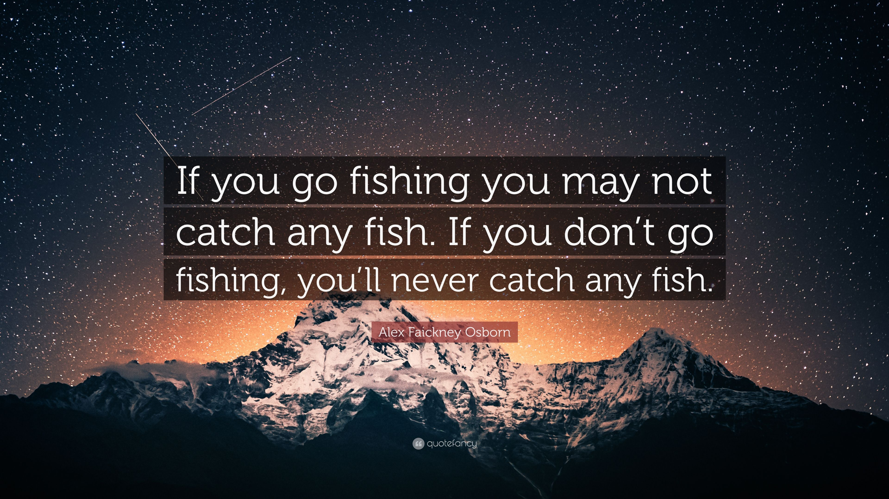

## Plug for Next Caps Series: Nov 9th

 
 

* **NEVER APPLY BLINDLY**
    + Let us review your application materials

 

* **Be prepared to apply to many things**
    + Get your application materials organized

 

* **See you next month!!**

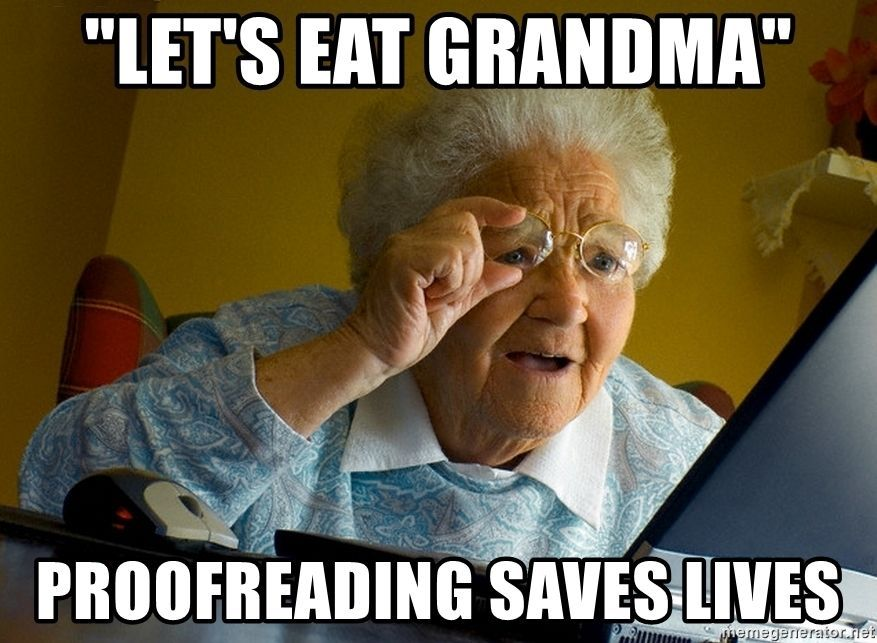

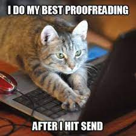
