## Beyond the classroom: Opportunites are vast

* **Research opportunities exist year round**
    + Shepherd - Independent research (fall/spring)
    + Shepherd - local- Summer programs/Internships
    + Regionally - Partnerships for West Virginia Students
    + Nationally (and beyond) - Semester and summer programs
    
 

* **Internships (paid or unpaid)**
    + Industry
    + Healthcare
    + Animal Care
    + Data Science
    
 

* **Study Abroad programs**
    + Summer, semester and year long

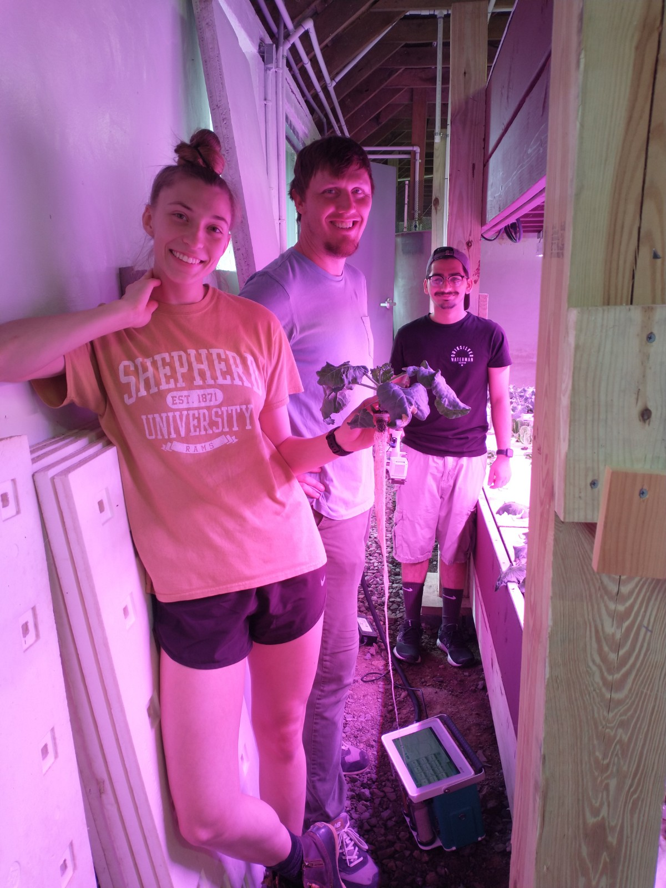

## Why should you pursue research opporunities?

 
 

* **Test the waters...**
    + Is this something I could see myself doing my whole career?
    
 

* **Set your resume apart from others**
    + STEM job market is competitive
    + Graduating undergraduate resumes are 'light on content'
    + Output from research = Currency for future opportunities
    
 

* **Gain experience in chosen field...**
    + embrace your natural science curiosity

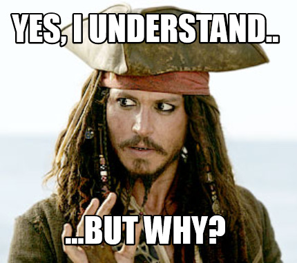

<!-- ## Why should you pursue research opporunities? -->
<!-- 
 -->
<!--   -->
<!--   -->
<!--   -->

<!-- 
 -->

<!-- * **Create a professional network** -->
<!--     + Many future opportunities are created by YOU -->
<!--     + Collaborations can last your whole career -->

<!--   -->

<!-- * **Broaden your horizons...** -->
<!--     + Work with people from all background due to the global nature of science -->

<!-- 
 -->

<!--  -->

<!-- ## Dr. C's undergraduate experiences... -->
<!-- 
 -->
<!--   -->

<!-- 
 -->

<!-- * **Study Abroad Costa Rica: Medicinal Plants** -->
<!--     + Paid for by summer work at golf course -->
<!--     + 5 week course in July -->

<!--   -->

<!-- * **Study Abroad Costa Rica: Primate Behavior** -->
<!--     + Paid for by summer work at golf course -->
<!--     + 5 week course in December -->

<!--   -->

<!-- * **Greenhouse internship at BASF (chemical corporation)** -->
<!--     + $7/hr - I was rich!!! -->

<!-- 
 -->

<!-- 
 -->

<!-- **Although I was too immature to know it at the time, these experiences defined by future path** -->

<!-- 
 -->

<!-- 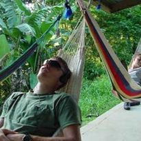 -->

<!-- ## When should you start looking/applying??? -->
<!-- 
 -->
<!--   -->

<!-- 
 -->

<!-- * **Power through your first year and focus on grades** -->
<!--     + Set a standard for yourself -->
<!--     + Don't be afraid to be excellent -->

<!--   -->

<!-- * **Sophomore and Junior Years are ideal** -->
<!--     + You should be in a 'college groove' -->
<!--     + Many external programs target these years -->
<!--     + Enough time to complete meaningful independent research -->
<!--     + Build your resume in a sustainable way that also balances school -->

<!--   -->

<!-- * **These are just suggestions!!!** -->
<!--     + Reflect on every semester and decide what you can, should and want to do -->

<!-- 
 -->

<!-- 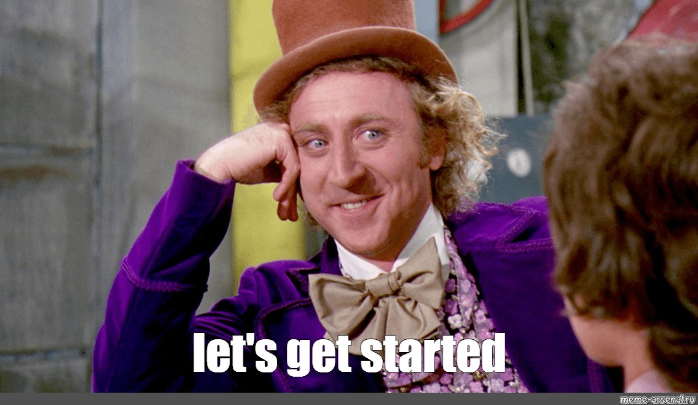 -->

<!-- ## Where to start.... -->
<!-- 
 -->
<!--   -->
<!-- **Don't worry...the different science departments at Shepherd have your back!!** -->

<!-- 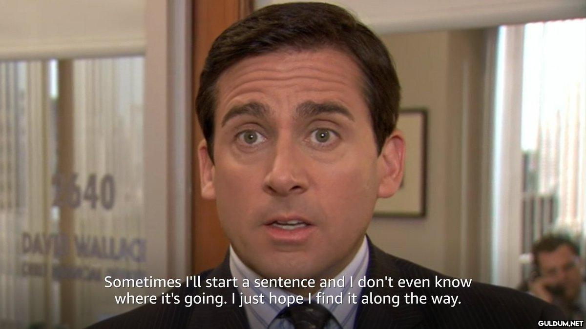 -->

## Shepherd: Many faculty run small research programs

* **Do some background work:**
    + Look at faculty profiles on department webpages
    + Build relationships with professors during courses
    + Search their research history online (Google Scholar)
    
 

* **Express an interest in related research to a faculty that resonates with you**
    + Have some common interests to discuss
    + DO NOT: Hey Dr. C, I want research experience for med school, can I work in your lab?
    + You do not have to have a solid project in mind!
  
 

* **The realities of undergraduate research at Shepherd...**
    + Faculty teach a lot! (this differs from other places)
    + Faculty have limited time for research
    + Don't take it personally if we have to say 'no'
    
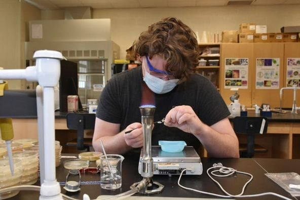

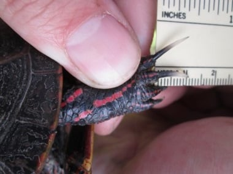

## Shepherd University: Internal research programs

 

* **Shepherd Opportunities to Attract Research Students (SOARS) program**
    + 10 week summer research program
    + Students receive a stipend (~$4,000)
    + Individual faculty mentors across STEM departments
    + Research presented at WVAS conference
    + Applications and mentor list posted in January (due February)

 

* **NASA West Virginia Space Grant Consortium fellowship program**
    + Students apply in September (all STEM fields)
    + Receive stipends for Fall and Spring research
    + Present a poster at WVAS

 

* **KEY ADVICE: Talk to potential mentors before applying**
    

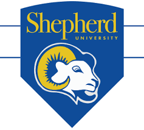

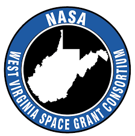

## Beyond Shepherd: Regional opportunties are vast

 

* **West Virginia INBRE - Biomedical Summer Research (http://www.wv-inbre.net/)**
    + Competitive federal research program of the National Institutes of Health
    + Open to the network of WV undergraduate institutions
    + Mentored research at WVU or Marshall University

 

* **Program specifics (applications due early February)**
    + Students receive a stipend (~$6,000)
    + 9-week summer program
    + Work with faculty and graduate students
    + Present at research symposium

 

* **Lots of research topics: genetics and health, cancer biology, neurobiology, etc.**
    + Covers many science disciplines

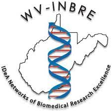

## Beyond Shepherd: Regional opportunties are vast

* **American Heart Association - Summer Research Program at Marshall University**
    + https://jcesom.marshall.edu/research/office-of-research-and-graduate-education/research-clusters/cardiovascular-disease-research-cluster-cdrc/
    + 9-week summer research experience 
    + Students receive a stipend (~$6,000)
    + Research related to heart disease and stroke
    
 

* **Smithsonian Environmental Research Center (SERC) internships**
    + https://serc.si.edu/internships
    + research experiences cover environmental chemistry, marine and estuarine ecology, molecular ecology, and terrestrial ecology
    
  

* **Smithsonian Institution internships**
    + https://www.si.edu/ofi   
    + Musuem - zoo - research
    
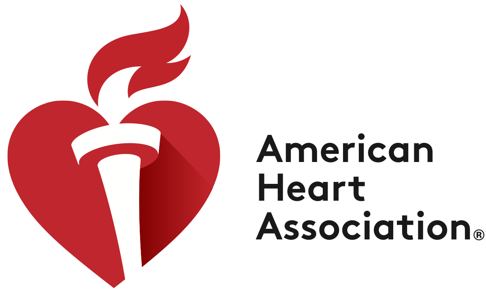

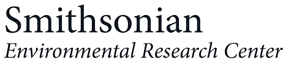

## Beyond Shepherd: Pathway Programs are close (and far)

 
    
* **Pathways Programs at National Parks (Shenandoah NP)**
    + https://www.nps.gov/aboutus/pathways.htm
    + paid internships to explore park service careers
    
 

* **Pathways Programs at USGS (e.g., Reston, VA)**
    + https://www.usgs.gov/human-capital/pathways-internship-program  

  

* **Pathways Programs at the USDA**
    + https://www.usda.gov/youth/career
    + Fruit research center near Kearneysville, WV
    
 

**Get to know https://www.usajobs.gov/ for all federal gov't opportunities**

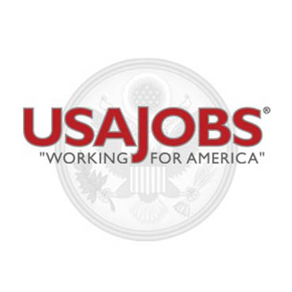

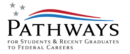
    
## Beyond Shepherd: Industry internships are vast

* **Available for many disciplines (chemistry, biology, engineering, etc.)**

 

* **Merck Pharmaceutical internships:**
    + https://jobs.merck.com/us/en/student-opportunities
    + https://jobs.merck.com/us/en/interns

 

* **Proctor & Gample Internships:**
    + https://www.pgcareers.com/internships

 

* **Eli Lilly Internships:**
    + https://careers.lilly.com/us/en/

 

* **Search webpages of Millapore Sigma, Pfzier, BASF, Ecolab, EPA, Neogen, Gilead, Bristol Myers Squibb, 3M, GSK, Corteva, Amgen, AbbVie.**
    

## DC and Frederick, MD are hotbeds for biotechnology

**https://www.biospace.com/biocapital/** - Therapeutics and Vaccines development are thriving

## Find and use the listservs - job sites for your field of interest

* **A few large science job boards exists**
    + https://jobs.sciencecareers.org/
    + Not always great for internships

 

* **Ecology and Environmental biology**
    + ECOLOG-L (hosted by Ecological Society of America)
    
 

* **Many national societies have opportunity boards by career stage:**
    + Cell Biology: https://jobs.ascb.org/
    + Biochemistry and Molecular Biology:  https://careers.asbmb.org/
    + Ecology: https://www.esa.org/career-development/
    + Chemistry: https://getexperience.acs.org/
    + Chemistry: http://global.acs.org/
    + Engineering: https://www.asee.org/education-jobs/FELLOWSHIPS/EcoCAR
    
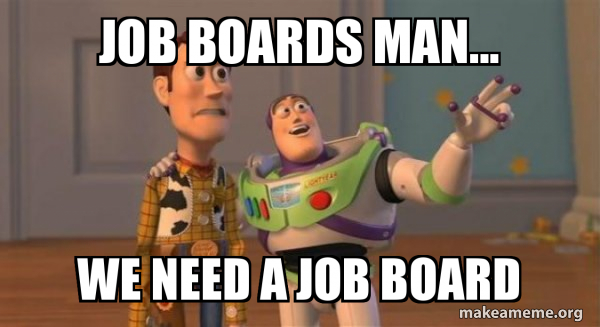
    
## Gold Standard Opportunites: NSF-REU

* **National Science Foundation - Research Experience for Undergraduates**
    + https://www.nsf.gov/crssprgm/reu/reu_search.jsp
    + Atudents receive a stipend (~$6,000)
    + Assitance with travel and housing provided
    + Provides additional career training
    + Groups of ~10 undergraduates at a host institution

 

* **NSF REU programs cover most STEM disciplines**
    + Many REU sites across the USA
    + Target sophomore and junior (not a hard rule)

 

* **NSF REU's are extremely competitive**
    + Application window: November - February (you must actively search)
    + Likely need to apply for many in one cycle
    + Shepherd students are absolutely competitive!

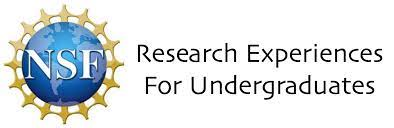  

## Gold Standard Opportunites: NIH-SIP

 

* **National Institute of Health - Summer Internship program**
    + https://www.training.nih.gov/programs/sip
    + Spend summer working with leading biomedical researchers
    + 8-week program with a stipend (changes yearly)
    + Provides additional career training
    + Present at symposium 
    + Main campuses are near Baltimore & DC (others exist)

 

* **NIH SIP's are extremely competitive**
    + Application window: opens November 15th

 

* **Provide webinars and resources to help you apply**
    + See website
    
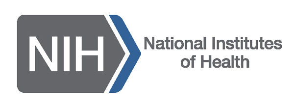  
  
<!-- ## Just go for it!! -->
<!-- 
 -->

<!-- 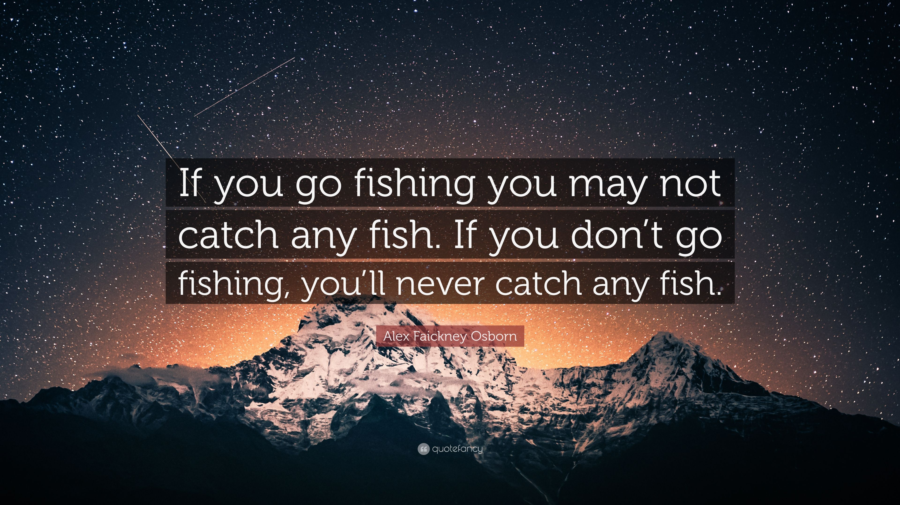 -->

<!-- ## Plug for Next Caps Series: Nov 15^th^ -->
<!-- 
 -->
<!--   -->
<!--   -->

<!-- * **Preparing Your Application** -->
<!--     + NEVER APPLY BLINDLY -->
<!--     + Let us review your application materials -->

<!--   -->

<!-- * **Be prepared to apply to many things!** -->
<!--     + Get your application materials organized -->

<!--   -->

<!-- * **See you next month!!** -->

<!-- 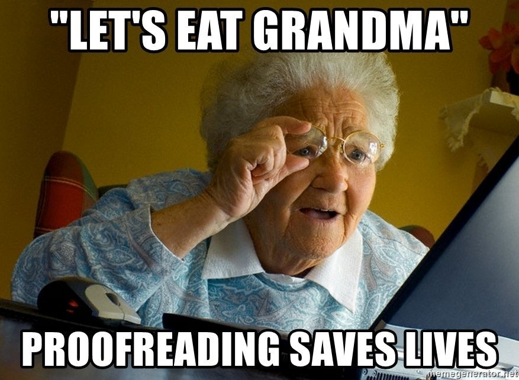 -->

<!-- 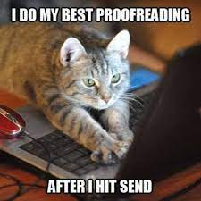 -->

## Scan Me!!

  