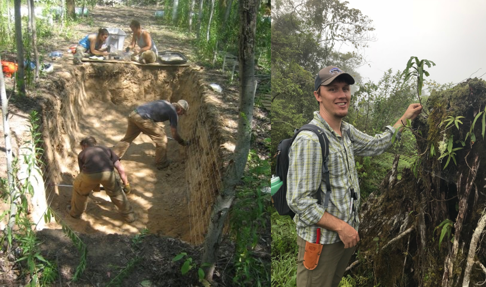
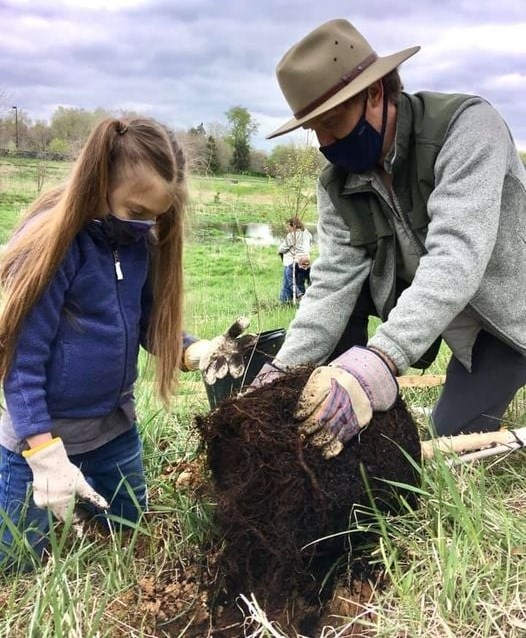
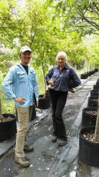
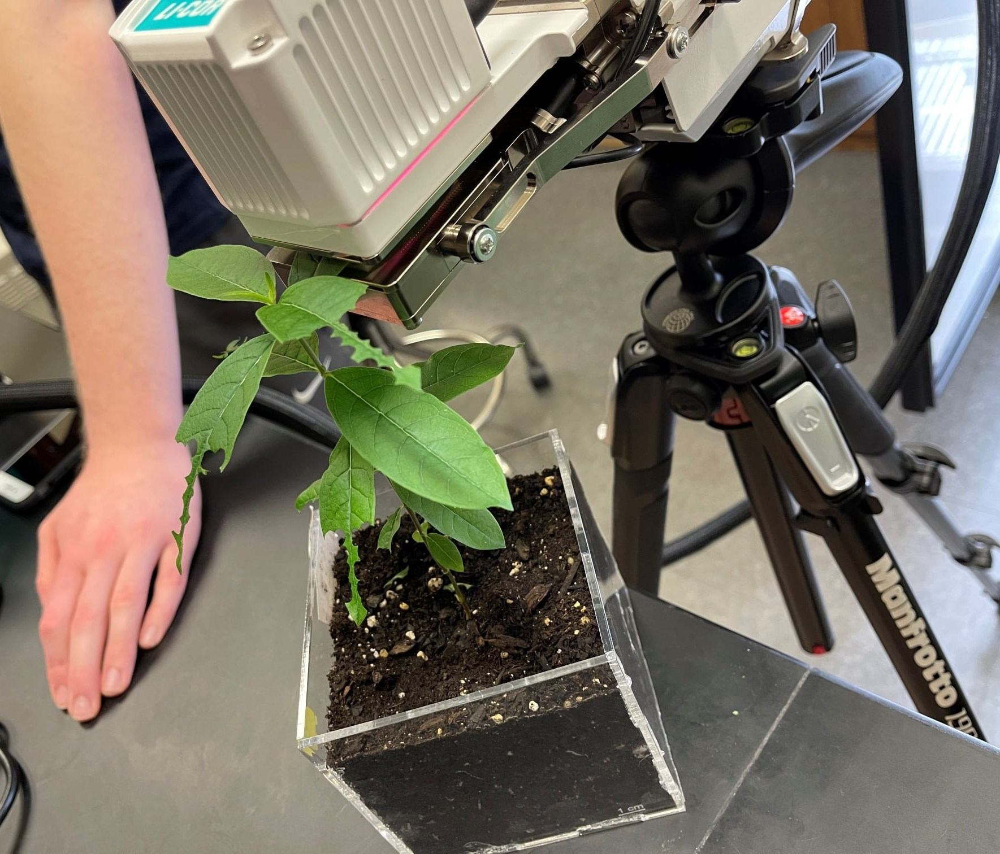
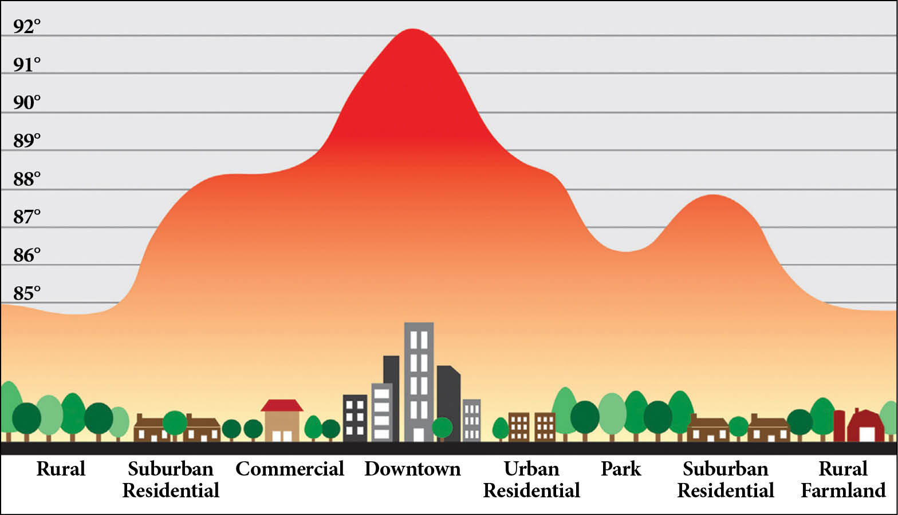
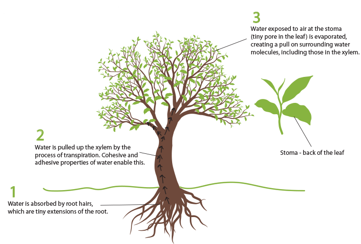
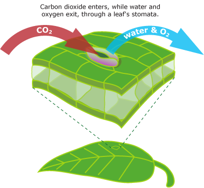
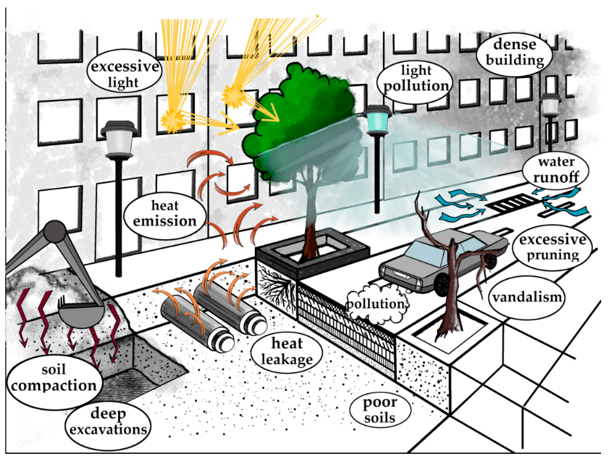
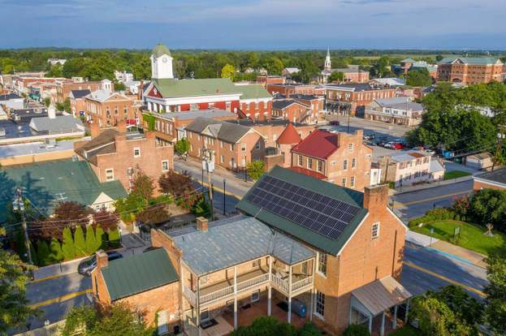

## About me: Ecology can take you places

 

* **Assistant Professor, Shepherd University**
    
 

* **Plant Ecophysiologist**
    + climate change
    + physiology
    + evolution
    
 

* **Ecosystem Ecologist**
    + global change

## About me: Ecology can take you places

 

* **Assistant Professor, Shepherd University**
    + long road to academia
    
 
 
 
 
 
 
 

* **Love to teach!!**

 

* **Community oriented projects to cure 'Plant Blindness'**
    + Tree Campus USA
    + Monarch Butterfly waystations
    + Urban tree benefits

## About me

 

* **Assistant Professor, Shepherd University**

 

* **Plant Ecophysiologist**
    + climate change, physiology, evolution
* **Ecosystem Ecologist**
    + global change

 

* **twitter: @court_campany**

## Experience with the landscape nursery industry

* **Post-doctoral position in collaboration with Hort Innovation Australia**
    + understand the role of root:shoot balance for landscape trees
    + evaluate the national standard for growing landscape trees

 

* **Year-long campaign to measure key traits for trees tagged as 'ready to sell"**
    + 23 nurseries across Australian climate regions
    + 14,000 trees surveyed nation-wide
    + 18-3000 liter containerized trees tested
    + >150 species measured

 

* **Outcomes: Delivered data-driven suggestions for better criteria to test Australian tree stock sold for landscape plantings**
    + current standards to restrictive
    + trees are too often rejected
    + NEW national standard adopted

## Experience in tree physiology

 

* **Research career has explored how plants make food (photosynthesis) across multiple themes**
    + global change (*Eucalyptus*)
    + evolution (*Ferns*)
    + stress (*Common Milkweed*)
 
 
 
* **Integrated plant hydraulics (water supply and transport) into recent research**

  

* **The urban environment makes all these processes harder for trees!!!**

## Why urban trees matter

 

* **Healthy trees are integral to sustainable urban landscapes now and in the future.**

 

* **Never before have trees received the current level of attention as key component of sustainable urban design, delivering substantial benefits to ever growing cities.**

 

* **Services = cooling, storm water mitigation, carbon sequestration, improving air quality, biodiversity and property value**
    + make cities more liveable

## Why physiology matters for urban trees

## The urban enivronment is an ecophysiological challenge

 

* **Sources for managing urban trees are numerous**
    + planting guides
    + maintenance plans
    + species choice

 

* **None are directly related to tree physiology!!**
    + mostly symptom based

 

* **Shouldn't we first understand how trees respond to these stresses?**
    + nursery &rarr; site planting &rarr; recovery &rarr; establishment and growth

## Charles Town as a research site for novel urban tree research

* **Models predict West Virginia could increase by 3 °F  in winter, spring, and summer  & 4 °F  in fall by 2100**
    + new stresses for animals and plants
    
 

* **More trees is an obvious local health benefit**

 

* **There is an important knowledge gap**

 

* **PLAN: Track and monitor aspects of physiology from nursery to establishment for newly planted urban trees in Charles Town, WV**
    + planting site with sufficient impervious surfaces
    + control site without (park)
    + utilize WV Forestry Demonstration Grant
    + May-June field campaign (grant pending)
    
 
   

