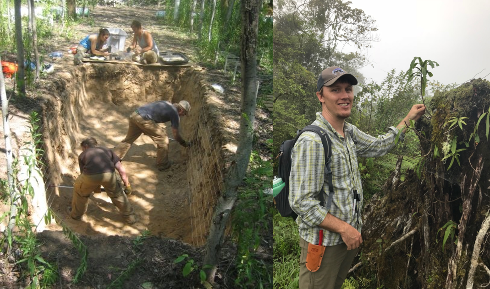
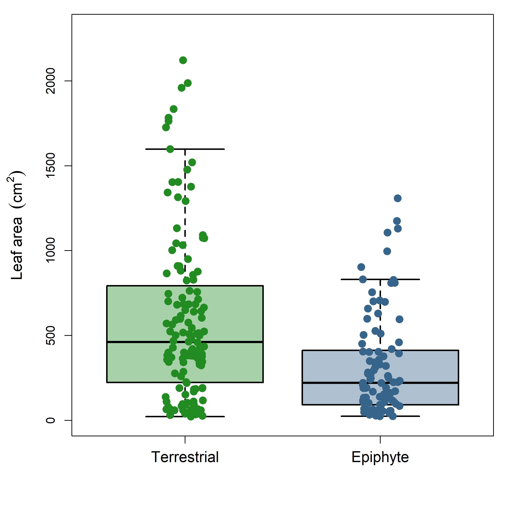

## About me: Ecology can take you places

 

* **Assistant Professor, Shepherd University**
    
 

* **Plant Ecophysiologist**
    + climate change
    + physiology
    + evolution
    
 

* **Ecosystem Ecologist**
    + global change

 

* **twitter: @court_campany**

## About me: Ecology can take you places

 

* **Assistant Professor, Shepherd University**
    + long road to academia
    
 
 
 
 
 
 
 

* **Love to teach!!**

 

* **Community oriented projects to cure 'Plant Blindness'**
    + Tree Campus USA
    + Monarch Butterfly waystations
    + Urban tree benefits

## Acknowledgements: Seed Free Society

 

**<ins>Collaborators</ins>**:
 
 
Alex Baer
 
**Juliette Bechard**
 
Miquel Chaves
 
*Helen Holmlund*
 
Christopher Krieg
 
**Evelyn Lawson**
 
**Lindsey Martin**
 
**Marisa Olavarria**
 
Jarmila Pitterman
 
**Michael Reed**
 
Eric Schuettpelz
 
**Abby Sotomayor**
 
Eddie Watkins
 
**Jacob Watts**

## Who are the spore-bearing vascular plants?

 

## Conquering land and revolutionary experimentation

 
 
 

* **<ins>Vascular tissues</ins>: “plumbing system"**

 

* **<ins>Lignin</ins>: tough hydrophobic molecule for support**
 
    + Waterproofs tissues

 

* **<ins>Leaves</ins>: rich in chloroplasts to maximize photosynthesis** 

 

* **<ins>Roots</ins>: that absorb water and minerals from soil**
    + evolved from rhizoids

## Why do spore-bearing vascular plants matter: Ecology

**Ferns are ecosystem filters (George 1999, Coomes et al. 2005)**
 
 
 
 
 
 
 
 
 
 
 
 
 
 
 
 
 
 
 
 

<!--  -->

**"Ferns are an unwritten text and every time we look at them carefully we find something totally new." Eddie Watkins**

## 'Ferns diversified in the shadow of angiosperms' Schiender 2004

 

<!--  -->

## Form and function in biology

## Plant form and function: Stomata

## Examining form and function through trait ecology

 

**Plants try to optimize function:**
 

1) maximize carbon gain (photosynthesis)
2) transport water and carbohydrates
2) grow and/or invest efficiently
3) reproduction (seeds)

 

**Global strategies in plant traits**
 

1) thick vs thin leaves
2) small seeds vs large seeds
3) allocation of nitrogen
4) fast vs slow growth
5) conservative or risky water use

## Global plant form and function: Angiosperm-centric

## Spore-bearing plants: Alternation of generations

## How are form and function optimized in spore-bearing plants?

* **How plastic are functional traits across habitats?**
    + heterogeneous tropical forest floors (E1)
    + sun & shade in temperate habitats (E2)
    + terrestrial vs epiphytes (E3)

 

* **Do coexisting plant lineages differ in ecophysiology?**
    + ferns vs *Selaginella* (E1)
    + ferns vs lycophytes vs angiosperms (E2)

 

* **How restrictive is evolutionary canalization?**
    + E1-3

 

* **How prevalent is the role of the gametophyte?**

## E1: *Selaginella* ecophysiology across heterogenous forest floors

## E1: *Selaginella* leaf anatomical traits differ

## E1: *Selaginella* leaf physiological traits differ

## E1: ferns & *Selaginella* function differently in the shade

## E2: Comparing plant lineages in shade and sun

* **10 angiosperm, 16 fern & 5 lycophyte species**

 

* **Under-story low-light vs open-canopy high light**
    + 2 field sites in upstate NY
      
      
 

* **Key functional traits**
    + foliar chemistry (N, P)
    + stomatal density (SD) 
 
 

     
* **Physiological Measurements**
    + light response curves (LCP, $\phi$)
    + dark respiration (R~d~)
    + gas exchange (A~n~, g~s~)
    + water use efficiency (WUE)

## E2: Trait strategies vary between spore-bearing and seed plants

 
 
 

* **Component scores for angiosperms associated with optimizing photosynthesis**
    + A~n~, g~s~, SD, foliar N

 
 

* **Component scores for angiosperms associated with positive carbon balance**
    + LCP, R~d~, WUE
    

## E2: Angiosperms exhibit more plasticity in traits with &uparrow; light

 
 
 

* **Component scores for angiosperms and fern species broadly diverged across open and closed canopy habitats**
    + lycophytes not present in the sun...

 
 

* **Associations with physiological traits in open habitats were stronger for angiosperms**
    + ability to up-regulate traits related to photosynthetic gas exchange
    

## 

## Do spore-bearing plants live by the same rules?

 
 

* Gas exchange
* Photosynthetic biochemistry
* Leaf phosphorous
* Leaf nitrogen
* Stomatal traits
* Light compensation point
* Water-use efficiency
* Chlorophyll content
* Leaf thickness
 
* Spore-traits?

## A funny thing happeed on the way to the Cretaceous....

## Epiphytes are important in tropical plant ecology

 
 

* **Major component of rainforest biodiversity** 
    + orchids, cacti, bromeliads, lichens, mosses and **ferns**
    + up to 40% of plant biomass in cloud rainforest    (Nadkarni 1989)

 

* **Do not extract water or nutrients from the host plant or the ground** 

 

* **Evolved numerous times in all vascular plant lineages**
    + 31% of ferns species are epiphytes

## What plant traits led to the transition and success of epiphytes?

 
 
 
 
 

* **Wild west compared to forest floor**
    + high light
    + low pH
    + limited water
    + minimal soil
    + low access to nutrients

## E3: Comparing related fern groups from ground to canopy

 

* **39 species**

 

* **Terrestrial, *hemi-epiphytic* and epiphtic niches**
    + 2 field sites in Costa Rica
      
 

* **Suite of functional traits**
    + morphological
    + anatomical
    + physiological
    + hydraulic

<!--  -->

## Epiphytes have thick leaves (LMA) for water conservatism

## Epiphytic ferns should be built to resist wilting

## Not really true.....

## Epiphytes likely move water more efficiently

## Epiphytes likely move water more efficiently

## Epiphytes also have far fewer stomata!

 

## 
 
 
 
 
 
 

* **Epiphytic selection pressures drive trait evolution**

 

* **Traits with terrestrial origins**
    + thin lamina (leaves)
    + many stomata
    + high xylem area
    + long stipes

## Take home: Do spore-bearing plants live by the same rules?

 

* **Small in stature but big in importance**
    + ecosystem function
    + biodiversity
    + novel insights into plant evolution

 

* **Spore-bearing and seed plants live differently**
    + strategies to optimize physiology
    + broad variation in mean trait values
    
  

* **Canopy ferns adapted to avoid desiccation**
    + form
    + function
    + reproduction (gametophyte)?

